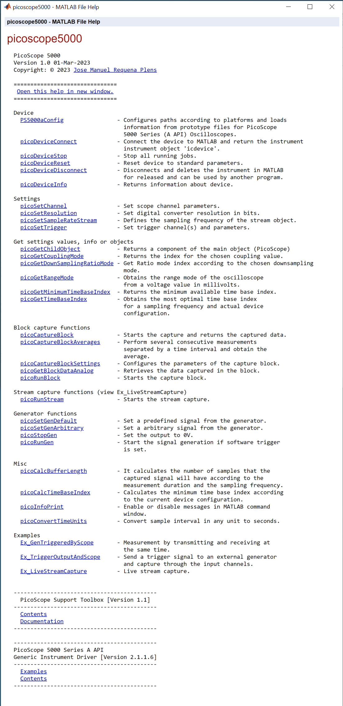
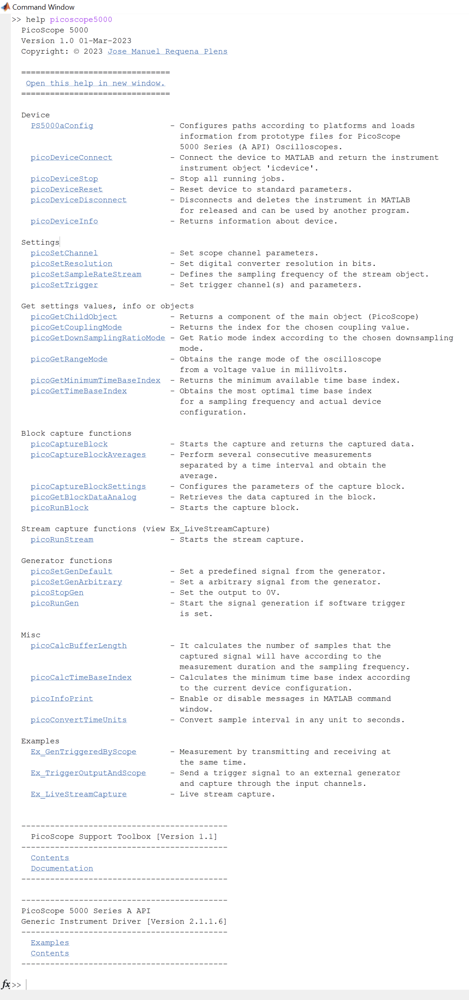

# picoScopeMATLAB
Library for working with the PicoScope 5000 series (and possibly other models) in MATLAB.

This repository includes the necessary toolboxes developed by Pico Technology:

- <a href="https://es.mathworks.com/matlabcentral/fileexchange/42820-picoscope-5000-series-a-api-matlab-generic-instrument-driver">PicoScope 5000 Series A API MATLAB Generic Instrument Driver</a>.
- <a href="https://es.mathworks.com/matlabcentral/fileexchange/53681-picoscope-support-toolbox">PicoScope Support Toolbox</a>.

It is only necessary to install the **PicoSDK** to make it fully functional. It can be downloaded here: https://www.picotech.com/downloads

At the moment it is only compatible with Linux and Windows. I have not been able to get it to work completely on MacOS. If you have information or have managed to get it to work correctly on MacOS, please contact me.

## Help

To see the help you can run one of these lines in matlab:
```matlab
addpath(genpath('picoscope5000'))
help picoscope5000
```
```matlab
addpath(genpath('picoscope5000'))
doc picoscope5000
```
|                    Using `doc`                   |                    Using `help`                   |
|:------------------------------------------------:|:-------------------------------------------------:|
|  |  |

## Examples

Open the **Examples.m** file, where you will find some examples.
You can see the code in the **picoscope5000** folder or by executing `open` + the name of the example.
